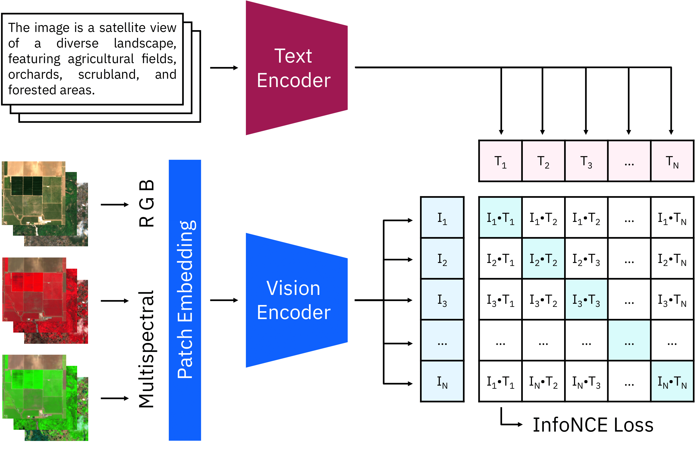
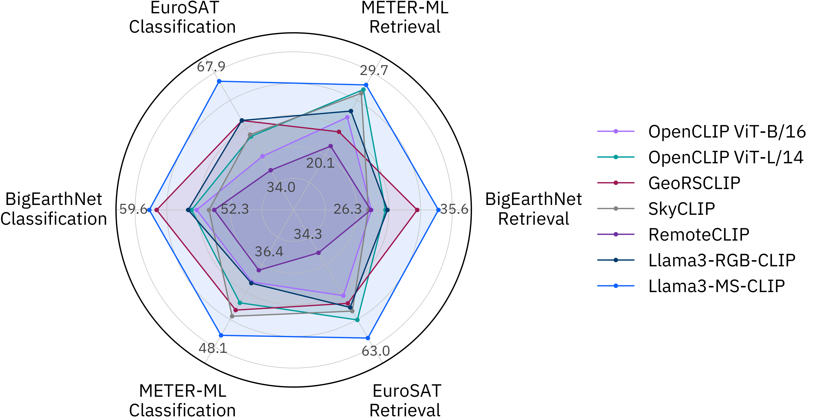

[](https://arxiv.org/abs/2503.15969)
[](https://huggingface.co/ibm-esa-geospatial/Llama3-MS-CLIP-base)

# Llama3-MS-CLIP
Multispectral Vision-Language Learning for Earth Observation

<p align="center">
    
</p>

**[Clive Tinashe Marimo](https://www.linkedin.com/in/clive-tinashe/), [Benedikt Blumenstiel](https://www.linkedin.com/in/blumenstiel/), [Maximilian Nitsche](https://www.linkedin.com/in/maximiliannitsche/), [Johannes Jakubik](https://www.linkedin.com/in/johannes-jakubik-8763ba167/), [Thomas Brunschwiler](https://www.linkedin.com/in/thomas-brunschwiler-234a6aab/)**


**IBM Research Europe, IBM Germany**

Llama3-MS-CLIP has been accepted at ECML PKDD 2025 🎉

## Architecture Overview

The CLIP model consists of two encoders for text and images. We extended the RGB patch embeddings to multispectral input and initialized the weights of the additional input channels with zeros. During the continual pre-training, the images and texts of each batch are encoded and combined. The loss increases the similarity of matching pairs while decreasing other combinations.



## Benchmarking

We evaluated Llama3-MS-CLIP with zero-shot classification and text-to-image retrieval results, measured in accuracy (%) ↑ and mAP@100 (%) ↑, respectively. 
The following Figure compares our model with the OpenCLIP baselines and other EO-VLMs. 
We applied a smoothed min-max scaling and annotated the lowest and highest scores. 
Our multispectral CLIP model is outperforming other RGB-based models on most benchmarks.



## Setup

How to run evaluation on benchmark datasets:
1. First clone this repository

```shell
git clone https://github.com/IBM/MS-CLIP
cd MS-CLIP
```
2. Prepare a new environment

```
python -m venv venv
source venv/bin/activate
pip install -r requirements.txt
pip install -e .
```

## Inference

To run classification and retrieval on custom images, classes and text queries use the `inference.py` file, for example:

```shell
python inference.py --run-classification \
    --model-name Llama3-MS-CLIP-Base \
    --images ./examples \
    --class-names ocean agriculture snow rural
    # --classes-file classes.txt  # Alternative via txt file  

python inference.py --run_retrieval\
    --model-name Llama3-MS-CLIP-Base \
    --images ./examples \
    --query "Agricultural fields in a rural area" \
    --top-k 3
    # --queries-file queries.txt  # Alternative via txt file
```

Example output for classification:
```text
╒════╤═══════════════════╤═════════╤═════════╤════════╤═════════╕
│    │ Image             │ Class   │   Ocean │   Snow │   Rural │
╞════╪═══════════════════╪═════════╪═════════╪════════╪═════════╡
│  0 │ 282D_485L_3_3.tif │ Ocean   │   0.857 │  0.000 │   0.143 │
├────┼───────────────────┼─────────┼─────────┼────────┼─────────┤
│  1 │ 637U_59R_1_3.tif  │ Rural   │   0.000 │  0.000 │   1.000 │
├────┼───────────────────┼─────────┼─────────┼────────┼─────────┤
│  3 │ 609U_541L_3_0.tif │ Snow    │   0.000 │  1.000 │   0.000 │
╘════╧═══════════════════╧═════════╧═════════╧════════╧═════════╛
```

Example output for retrieval:
```text
                                                      Image  Similarity
Query                               Rank                               
Agricultural fields in a rural area 1      637U_59R_1_3.tif    0.243049
                                    2      38D_378R_2_3.tif    0.189760
                                    3     433D_629L_3_1.tif    0.144854
                                    4     282D_485L_3_3.tif    0.011940
                                    5     609U_541L_3_0.tif   -0.004457
```

If you like to save the results in a csv, you can provide file path, with `--save-path results/your_retrieval_results.csv`.

## Evaluation

We provide more information on the expected data structure of the benchmark datasets in [DATASETS.md](DATASETS.md).

To run evaluation on all benchmarking datasets use the `evaluation.py` file, run:

```shell
python evaluation.py

# For other models, change the following default values:
python evaluation.py \
  --model-name Llama3-MS-CLIP-Base \
  --pretrained True \
  --save-name Llama3-MS-CLIP-Base \
  --templates msclip \
  --dataset-dir benchmark_datasets \
  --batch-size 64 \
  --workers 0 \
  --precision amp \
  --save-path results/
```

This will create a csv file for each dataset showing metrics like accuracy or mean average precision.

For testing Llama3-MS-CLIP on a new dataset, you can add the data loading and processing to [src/inference/benchmark_tool.py](src%2Finference%2Fbenchmark_tool.py) 
or run the inference script with `--save-path` and evaluate the saved results.

## Citation

Please cite the following paper, if you use the caption dataset and/or the Llama3-MS-CLIP model in your research:

```
@article{marimo2025beyond,
  title={Beyond the Visible: Multispectral Vision-Language Learning for Earth Observation},
  author={Marimo, Clive Tinashe and Blumenstiel, Benedikt and Nitsche, Maximilian and Jakubik, Johannes and Brunschwiler, Thomas},
  journal={arXiv preprint arXiv:2503.15969},
  year={2025}
}
```

## License

Built with Meta Llama 3. 

While the model itself is not based on Llama 3 but OpenCLIP B/16, it is trained on captions generated by a Llama 3-derivative model. Therefore, the model name starts with Llama 3 following its license (https://github.com/meta-llama/llama3/blob/main/LICENSE).